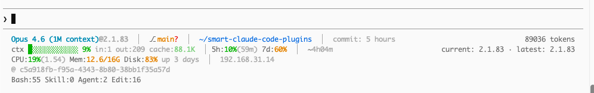

# smart-claude-code-plugins

<div align="center">

🌐 [English](./README.md) | [简体中文](./README_CN.md) | [繁體中文](./README_TW.md) | [한국어](./README_KO.md) | [日本語](./README_JA.md)

</div>

> Done coding? Just say **"create PR"** — it handles check, commit, push, and PR for you.
>
> Don't want a PR, just a push? Say **"push"**.
>
> Just commit? Say **"commit"**.
>
> Or use slash commands: `/smart:pr`, `/smart:push`, `/smart:commit`.

A Claude Code plugin that takes over the moment you finish writing code. Just say what you want — it runs checks, commits, pushes, and opens a PR to `main`. Zero extra steps. Just say `push` — it auto-splits multiple features, generates commit messages, and pushes:


---

## Features

- **Two-Phase Smart Commit Grouping** — Phase 1 hard-splits by type (feat vs fix vs refactor), Phase 2 semantically splits within the same type by purpose. No unrelated changes sneak into a single commit.
- **Fail-Fast Pipeline** — Any step fails, everything stops immediately. No partial pushes or broken PRs.
- **Auto CI Detection** — Reads `.github/workflows/*.yml` and runs matching checks locally (ruff, pytest, eslint, tsc, jest, go test, turbo, and more).
- **Auto GitHub Repo Creation** — No remote configured? It creates one for you.
- **Conventional Commits** — All commit messages follow `<type>(<scope>): <description>` format automatically.
- **Consistent Language** — PR title, summary, and test plan automatically use the same language as the commit messages. Defaults to English; overridable via project `CLAUDE.md`.
- **File Protection Hook** — Prevent Claude from editing sensitive files (`.env`, lock files, etc.). Configure per-project via `.claude/protect_files.jsonc` — supports exact filename matching and glob patterns (`*`, `**`).
- **Session Hooks** — Greet on session start, goodbye on session end.
- **Context Analyzer Agent** — Analyze which plugins consume the most context window. Shows a ranked table with sizes and percentages.
- **HUD / Statusline Installer** — One command to install a feature-rich statusline showing model, git branch, context usage, rate limits, system stats, and tool call counts. Supports install / remove / rewind.
- **Joke Teller Agent** — Automatically tells a joke at the right moment to lighten the mood during work.

---

## Two Ways to Use

**💬 Just say it** — type naturally in chat:

- "commit" / "save my work" → stages & commits with smart grouping
- "push" → check + commit + push
- "create PR" / "open a PR" → check + commit + push + PR

**⌨️ Slash commands** — for when you want to be explicit:

| Command | What it does |
|---|---|
| `/smart:pr [base]` | Full pipeline: check → commit → push → PR (default base: `main`) |
| `/smart:push` | check → commit → push (no PR) |
| `/smart:commit` | Stage & commit only (smart grouping, auto message) |
| `/smart:check` | Run local CI checks only (auto-detects from workflow config) |
| `/smart:hud` | Install smart statusline (model, git, context, rate limits, system stats) |
| `/smart:hud rm` | Remove the statusline |
| `/smart:hud rewind` | Restore your previous statusline from backup |

---

## Quick Start

**1. Install the plugin** _(recommended)_

In Claude Code, register the marketplace first:

```
/plugin marketplace add hinson0/smart-claude-code-plugins
```

Then install the plugin from this marketplace:

```
/plugin install smart@smart-claude-code-plugins
```

**2. Authenticate GitHub CLI** _(one-time setup)_

```bash
gh auth login
```

**3. That's it. Run this in any repo:**

```
/smart:pr
```

It will automatically: detect CI checks → run them locally → stage & commit → push → open a PR on GitHub.

---

## How It Works

```
/smart:pr
    │
    ├── 1. check   — reads .github/workflows/*.yml, runs matching local checks
    │                (ruff/pytest, eslint/tsc, go test — skips if no CI config)
    │
    ├── 2. commit  — two-phase semantic analysis:
    │                Phase 1: hard-split by type (feat/fix/refactor/...)
    │                Phase 2: split same-type changes by purpose
    │                (auto-generates Conventional Commit messages)
    │
    ├── 3. push    — pushes to origin
    │                (auto-creates GitHub repo if origin is not configured)
    │
    └── 4. pr      — opens a Pull Request with auto-generated title & body
                     (language follows commit messages from step 2)
```

Any step that fails stops the pipeline immediately.

---

## File Protection

Prevent Claude from editing sensitive files by creating `.claude/protect_files.jsonc` in your project root:

```jsonc
// Protected files — Claude Code cannot edit these
// Exact filenames match precisely; patterns with * or ** use glob matching
[
  ".env",
  "package-lock.json",
  "pnpm-lock.yaml",
  "yarn.lock",
  "*.secret",
  "config/production/**"
]
```

**Matching rules:**
- No wildcards → exact filename match (`.env` blocks `.env` but allows `.env.example`)
- `*` → glob match within a single directory level (`*.lock` matches `pnpm-lock.yaml`)
- `**` → recursive match across directories (`config/production/**` matches `config/production/db/secret.json`)

---

## HUD (Statusline)

Install a feature-rich statusline with one command:

```
/smart:hud
```



**What it shows (4 lines):**

| Line | Content |
|------|---------|
| 1 | Model@version, git branch (dirty/ahead/behind), directory, last commit time |
| 2 | Context progress bar + tokens + cache, rate limits (5h/7d) with reset countdown, session duration |
| 3 | CPU, memory, disk, uptime, runtime versions (Node/Python/Go/Rust/Ruby), local IP |
| 4 | Session ID, tool call stats (Bash/Skill/Agent/Edit) |

**Commands:**

| Command | Action |
|---------|--------|
| `/smart:hud` | Install (backs up existing statusline automatically) |
| `/smart:hud rm` | Remove statusline |
| `/smart:hud rewind` | Restore your previous statusline from backup |

---

## Requirements

- [Claude Code](https://claude.ai/code) CLI
- `git`
- [`gh` CLI](https://cli.github.com) — for push (auto-create remote) and PR creation

---

## Author

**Hinson** · [GitHub](https://github.com/hinson0)

## License

MIT
