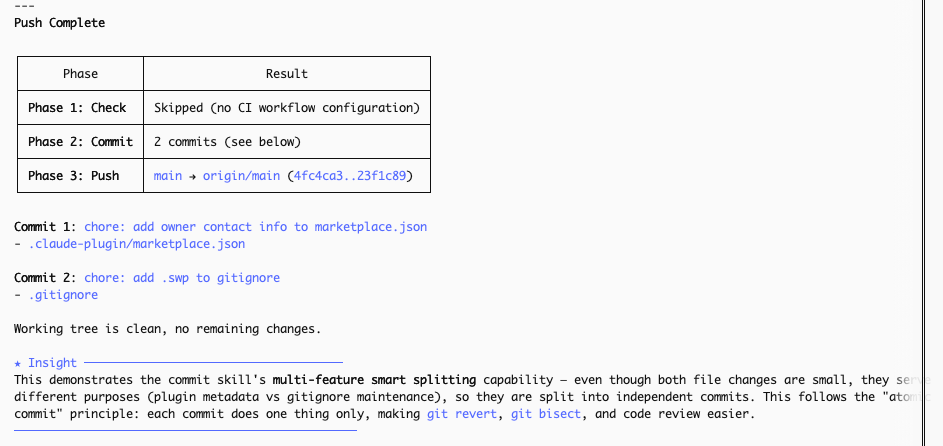

# smart-claude-code-plugin

<div align="center">

🌐 [English](./README.md) | [简体中文](./README_CN.md) | [繁體中文](./README_TW.md) | [한국어](./README_KO.md) | [日本語](./README_JA.md)

</div>

> Done coding? Just say **"create PR"** — it handles check, commit, push, and PR for you.
>
> Don't want a PR, just a push? Say **"push"**.
>
> Just commit? Say **"commit"**.
>
> Or use slash commands: `/smart:pr`, `/smart:push`, `/smart:commit`, `/smart:check`.

A Claude Code plugin that takes over the moment you finish writing code. Just say what you want — it runs checks, commits, pushes, and opens a PR to `main`. Zero extra steps.



---

## Two Ways to Use

**💬 Just say it** — type naturally in chat:

- "commit" / "save my work" → stages & commits with smart grouping
- "push" → check + commit + push
- "create PR" / "open a PR" → check + commit + push + PR

**⌨️ Slash commands** — for when you want to be explicit:

| Command | What it does |
|---|---|
| `/smart:pr [base]` | Full pipeline: check → commit → push → PR (default base: `main`) |
| `/smart:push` | check → commit → push (no PR) |
| `/smart:commit` | Stage & commit only (smart grouping, auto message) |
| `/smart:check` | Run local checks inferred from CI config only |

---

## Quick Start

**1. Install the plugin** _(recommended)_

In Claude Code, register the marketplace first:

```
/plugin marketplace add hinson0/smart-claude-code-plugin
```

Then install the plugin from this marketplace:

```
/plugin install smart@smart-claude-code-plugin
```

**2. Authenticate GitHub CLI** _(one-time setup)_

```bash
gh auth login
```

**3. That's it. Run this in any repo:**

```
/smart:pr
```

It will automatically: detect CI checks → run them locally → stage & commit → push → open a PR on GitHub.

---

## How It Works

```
/smart:pr
    │
    ├── 1. check   — reads .github/workflows/*.yml, runs matching local checks
    │                (ruff/pytest, eslint/tsc, go test — skips if no CI config)
    │
    ├── 2. commit  — semantic diff analysis, auto-generates commit messages
    │                (splits into multiple commits if independent features detected)
    │
    ├── 3. push    — pushes to origin
    │                (auto-creates GitHub repo if origin is not configured)
    │
    └── 4. pr      — opens a Pull Request with auto-generated title & body
```

Any step that fails stops the pipeline immediately.

---

## Requirements

- [Claude Code](https://claude.ai/code) CLI
- `git`
- [`gh` CLI](https://cli.github.com) — for push (auto-create remote) and PR creation

---

## Author

**Hinson** · [GitHub](https://github.com/hinson0)

## License

MIT
