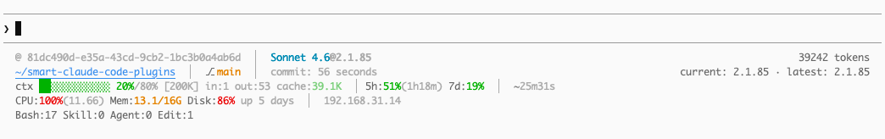

# smart-codex-plugin

<div align="center">

🌐 [English](./README.md) | [简体中文](./README_CN.md) | [繁體中文](./README_TW.md) | [한국어](./README_KO.md) | [日本語](./README_JA.md)

</div>

> Finished coding? Run **`/smart:commit`** in Claude Code or **`$smart:commit`** in Codex.

A dual-host plugin for **Claude Code** and **Codex** with focused developer workflows, content tools, session utilities, and engineering rules.

---

## Quick Start

The plugin ships **both manifests** (`.claude-plugin/` for Claude Code and `.codex-plugin/` for Codex), so it installs natively in either host. Pick yours:

### Claude Code

Add the marketplace, then install the plugin — run these inside Claude Code:

```
/plugin marketplace add hinson0/smart-claude-code-plugins
/plugin install smart@smart
```

> Already cloned locally? Point the marketplace at your clone instead: `/plugin marketplace add /path/to/smart-claude-code-plugins`. After installing, restart the session so skills, hooks, and the statusline load.

### Codex

The friendliest way is right inside a Codex session — no clone needed:

1. Run `/plugins`
2. Select **[Add Marketplace]**
3. Paste the source — `hinson0/smart-claude-code-plugins` (owner/repo) or the full git URL — and press Enter
4. Open the **Smart** marketplace, then install the **smart** plugin

> Prefer the CLI? It fetches straight from Git — no clone needed:
>
> ```bash
> codex plugin marketplace add hinson0/smart-claude-code-plugins
> codex plugin add smart@smart
> ```

---

## Plugin in This Marketplace

This repository publishes one dual-host plugin:

| Plugin | Install | Purpose |
|--------|---------|---------|
| Smart | `smart@smart` | Developer workflows, HTML/PDF/Wiki tools, weekly reports, and session utilities |

Claude Code uses `/smart:*`; Codex exposes the corresponding `$smart:*` skills.

```bash
# Claude Code, after adding the marketplace
/plugin install smart@smart

# Codex, after adding the marketplace
codex plugin add smart@smart
```

Smart includes seventeen skills: `ask`, `close-issue`, `code-simplifier`, `commit`,
`generate-wiki`, `github-skills-pdf`, `help`, `html`, `hud`, `learning`, `local`,
`matt-implement-all-tickets`, `my-weekly`, `one-by-one`, `pair-write`, `pr`, and `show`.
Some workflows require Git, `gh`, `glab`, Node.js, Python/PDF
tooling, browser access, or document capabilities; each skill checks its own prerequisites.
Every skill is user-invoked only: start it explicitly with its `/smart:*` or
`$smart:*` name instead of relying on model invocation.
Codex displays each skill as `smart:<name>`, preserving its Claude Code
invocation name without the leading slash or a separate title.

---

## Features

**Smart Commit**

- **Low-Cost Execution** — Claude Code uses Haiku; Codex delegates the complete commit workflow to one low-reasoning GPT-5.6 Luna worker, with one default-subagent fallback.
- **Semantic Grouping** — Type is a hard boundary and purpose is a soft boundary, so independent changes become independent commits.
- **Repository-Aware Messages** — Respects project rules, recent Git history, then Conventional Commits.
- **Commit Only** — No CI checks, version changes, push, or pull request creation.

**Protection & Automation**

- **Session Hooks** — Greet on session start (via macOS `say` TTS).
- **Session Logs** — Every tool call is logged to `.smart/session-logs/` with full input data for post-session debugging and audit.
- **Serial Ticket Delivery** — `/smart:matt-implement-all-tickets`, explicitly loaded with Matt `/implement`, keeps one orchestrator session while fresh workers implement, verify, record, and close the current `/to-tickets` output one Ticket at a time. It supports configured GitHub, GitLab, and local Markdown trackers and stops on the first incomplete closeout.
- **Auditable GitLab Issue Closeout** — After `/implement` has committed and reviewed the work, `/smart:close-issue` verifies the implementation commit on the current branch, acceptance evidence, and review conclusion. With explicit close authorization, it publishes those development assets before closing; target-branch integration is disclosed but is not a close gate. It uses `glab` and never implies push, merge, MR/PR creation, checklist edits, or label changes.

**Utilities**

- **HUD / Statusline Installer** — One command to install a feature-rich statusline showing model, git branch, context usage, rate limits, system stats, and tool call counts. Two install levels (minimal / full) plus restore from backup, user scope.
- **Help Overview** — `/smart:help` dynamically scans and lists all skills, hooks, and agents with descriptions.
- **Read-Only Guidance** — `/smart:ask` returns a concise judgment, command, snippet, or checklist without modifying files or running tools.
- **Fresh-Context Code Simplification** — `/smart:code-simplifier` sends the complete run to one serial, non-recursive worker with no conversation history. The primary stays out of the target code while the worker scopes recent changes, follows repository standards, and proves behavior equivalence.
- **One-Cycle TDD** — `/smart:one-by-one` validates one minimal Red test, then guides the user through the matching Green implementation.
- **Pair Writing** — `/smart:pair-write` gives one user-written coding step a comment skeleton and directly expanded reference, then checks only transcription and agreement with that guidance by default.
- **Markdown to HTML** — `/smart:html` deterministically converts one Markdown file into safe, self-contained HTML without opening a browser.
- **Wiki Generation** — `/smart:generate-wiki` turns source material into a GitLab, GitHub, or local Markdown Wiki with guarded publishing.
- **Bilingual Skills PDF** — `/smart:github-skills-pdf` pins a GitHub skills repository and builds a verified English-Chinese A4 handbook.
- **Personal Weekly Report** — `/smart:my-weekly` summarizes the current user's commits for a selected natural week.
- **Bundled Coding Rules** — Pre-written rule files (e.g. Pydantic V2 standards) in `rules/`. Symlink any file to your project's `.claude/rules/` to activate it.
- **Learning Mode** — `/smart:learning 1` turns on a simple co-coding mode where *you* hand-write the code yourself. It is a plain on/off switch — no ratios, no config. While on, any code Claude would write goes to the console instead — each piece labeled New file / New code / Modify / Delete with its file and location — for you to type in, and Claude reviews what you land before moving on, one task at a time. Enabling injects the rules into `.claude/CLAUDE.local.md` (the git-ignored per-project memory Claude Code loads every session) so they persist; the presence of that block is the entire state, and `/smart:learning 0` removes it. Nothing is stored in `.smart/settings.json`.
- **HTML Review Pages** — `/smart:show` renders a long deliverable — the current conversation's plan/analysis/review, or a Markdown file — as a single self-contained, zero-JavaScript HTML review page and opens it in the browser. Card-on-gray visual system: sticky TOC, numbered sections, risk badges, option-comparison cards (chosen one highlighted), inline SVG diagrams, and `<details>` folding. Three fixed layout recipes (plan-review / explainer / report) keep pages structurally consistent across runs. Every page carries a mandatory provenance footer (time, commit SHA, source) and is a derived view only — Markdown stays the source of truth. Each run writes a new timestamped file to `.smart/pages/` (git-ignored), preserving earlier pages as immutable review assets instead of overwriting them. Live demos in `assets/demos/`.

---

## Usage

**💬 Explicit invocation** — every skill starts only when you name it:
`/smart:*` in Claude Code or `$smart:*` in Codex.

**⌨️ Skill commands** — replace `/smart:` with `$smart:` in Codex:

| Command | What it does |
|---|---|
| `/smart:commit` | Stage & commit only (smart grouping, auto message) |
| `/smart:pr [branch]` | Create or update a PR; omitted branch requires confirmation of `main`, explicit branch skips confirmation; no auto-merge |
| `/smart:ask` | Return concise read-only guidance without executing or changing anything |
| `/smart:close-issue <IID-or-URL>` | Check one GitLab Issue read-only; with explicit close authorization, publish an auditable development asset note and then close it |
| `/smart:code-simplifier [paths-or-diff]` | Use one fresh-context worker to simplify recent code while preserving observable behavior |
| `/smart:matt-implement-all-tickets` | With Matt `/implement` explicitly loaded, implement and close the current `/to-tickets` output serially |
| `/smart:generate-wiki` | Distill source material into a guarded GitLab, GitHub, or local Wiki |
| `/smart:github-skills-pdf [--notes 2\|4]` | Build a verified English-Chinese A4 handbook from a GitHub skills repository |
| `/smart:html <input.md> [output.html]` | Convert Markdown to safe, self-contained HTML without opening a browser |
| `/smart:hud [0\|1\|2\|reset\|normal\|all]` | Install statusline (`1`/`normal`=minimal, `2`/`all`=full) or restore backup (`0`/`reset`), user scope |
| `/smart:help [skill\|hook\|agent]` | Show overview of all plugin components (or filter by category) |
| `/smart:learning [0\|1]` | Toggle learning mode — *you* hand-write the code; Claude prints each piece to the console labeled New file / New code / Modify / Delete for you to type in, then reviews what you land. `1`=on, `0`=off, empty=status. State is the injected block in `.claude/CLAUDE.local.md` — no settings, no ratios |
| `/smart:my-weekly <repo> [-N]` | Summarize the current user's commits for a selected natural week |
| `/smart:one-by-one` | Run one minimal Red-to-Green cycle at a time |
| `/smart:pair-write` | Guide one user-written step, then compare the landed code with its skeleton and reference |
| `/smart:show [<path>.md]` | Render the current conversation's deliverable (or a Markdown file) as a new timestamped, self-contained zero-JS HTML review page in `.smart/pages/`, preserve previous pages, and open it in the browser. Three layout recipes: plan-review / explainer / report |

---

## Smart Commit

`/smart:commit` reads status, staged and unstaged diffs, untracked file contents, and recent history; splits by type and independent purpose, including hunks within a file; and lists each group’s message and files before committing.

Claude Code runs the turn on `haiku`. Codex delegates the complete workflow to one low-reasoning `gpt-5.6-luna` worker. If Luna is unavailable, it retries once with the user's configured default subagent. The primary agent never performs grouping or commit work itself.

Every group stages only explicit paths or hunks and verifies its staged diff before committing; bulk staging is prohibited. The skill reports commit hashes, messages, and remaining changes. It never runs checks, changes versions, pushes, or creates pull requests.


---

## Bundled Rules

The plugin ships pre-written coding rule files in `rules/`. Activate any rule in your project by symlinking it to `.claude/rules/`:

```bash
ln -s /path/to/plugin/rules/pydantic-v2.md .claude/rules/pydantic-v2.md
```

**Available rules:**

| Rule file | What it enforces |
|---|---|
| `pydantic-v2.md` | Pydantic V2 standards: `ConfigDict`, validators, discriminated unions, `TypeAdapter`, `RootModel`, `SecretStr`, `pydantic-settings`, V1→V2 migration |
| `python-3.14.md` | Python 3.14 standards: deferred annotations, `[T]` generics, `@override`, `Self`, `TaskGroup`, `StrEnum`, `datetime.UTC`, subinterpreters, `match` guards |
| `fastapi.md` | FastAPI 0.115+ standards: `Annotated` dependencies, `lifespan`, `APIRouter` organization, `BackgroundTasks`, `dependency_overrides`, security scopes |
| `sqlalchemy-v2.md` | SQLAlchemy 2.0 standards: `DeclarativeBase`, `Mapped[T]`, naming conventions, async sessions, `AsyncAttrs`, `selectinload`, UPSERT, Alembic |

Rules are inactive by default — symlink only what's relevant to your project.

---

## HUD (Statusline)

Install a feature-rich statusline with one command:

```
/smart:hud
```



**What it shows (6 lines):**

| Line | Content |
|------|---------|
| 1 | Session ID / session name, model@version, total cost (USD) |
| 2 | Directory, git branch (dirty/ahead/behind/stash), last commit time, worktree name, battery |
| 3 | Context progress bar + tokens + cache, rate limits (5h/7d) with reset countdown, session duration, agent name |
| 4 | CPU, memory, disk, uptime, runtime versions (Node/Python/Go/Rust/Ruby), local IP |
| 5 | Tool call stats (Bash/Skill/Agent/Edit counts, parsed from transcript in real time) |
| 6 | Output style, vim mode (shown only when enabled) |

**Commands:**

| Command | Action |
|---------|--------|
| `/smart:hud` · `/smart:hud 2` · `/smart:hud all` | Install full statusline (all 6 lines) to user scope, auto-backup |
| `/smart:hud 1` · `/smart:hud normal` | Install minimal statusline (session + ctx only) |
| `/smart:hud 0` · `/smart:hud reset` | Restore your previous statusline from backup |

**Note:** Cross-platform (macOS + Linux/WSL/Ubuntu) — auto-detects the OS and picks the right tools for battery, CPU, memory, and IP. Requires `jq`; if it's missing, `/smart:hud` auto-installs it (apt/dnf/pacman/apk/brew).

---

## Session Hooks

The plugin includes hooks that trigger at session boundaries and tool calls:

| Hook | Trigger | What it does |
|------|---------|--------------|
| `greet.sh` | `SessionStart` | Plays a welcome message via macOS TTS (`say`) |
| `session-logs.py` | `PreToolUse` (all tools) | Logs every tool call's full input to `.smart/session-logs/<date>/<session_id>.json` |

The bundled hook config uses `${CLAUDE_PLUGIN_ROOT}` for path resolution in Claude-compatible hosts. TTS hooks run in the background (`nohup &`) to avoid blocking the host process.

---

## Requirements

- **Claude Code** or **Codex** (with plugin support) — the plugin ships both manifests and runs natively in either
- `git`
- Matt Pocock Skills with `/implement` — required by `/smart:matt-implement-all-tickets`
- [`gh` CLI](https://cli.github.com/) — for `/smart:matt-implement-all-tickets` with GitHub Issues
- [`glab` CLI](https://gitlab.com/gitlab-org/cli) — for `/smart:close-issue` and `/smart:matt-implement-all-tickets` with GitLab Issues
- Node.js — for `/smart:html` and closeout scripts
- Python 3 with `reportlab` and an embeddable CJK font — for `/smart:github-skills-pdf`
- `jq` — for HUD statusline only (optional otherwise)

---

## Author

**Hinson** · [GitHub](https://github.com/hinson0)

## License

MIT
