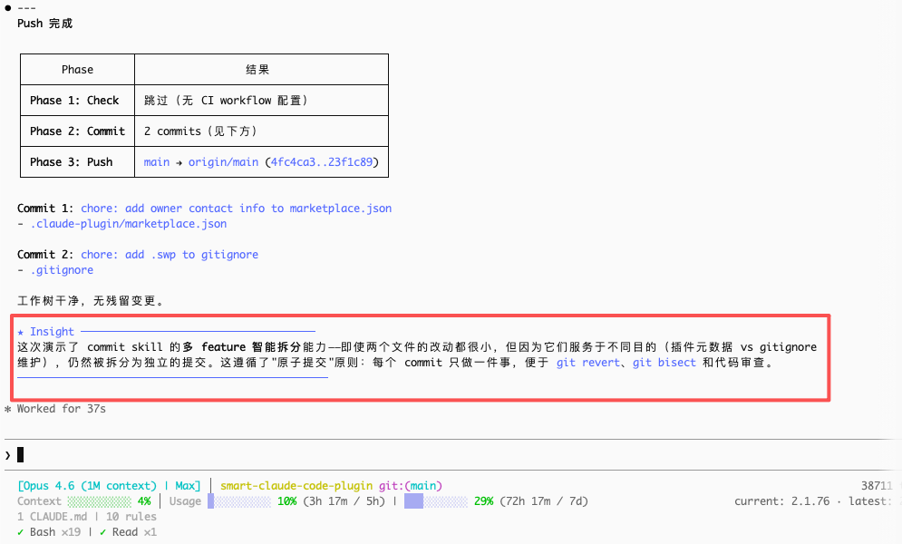
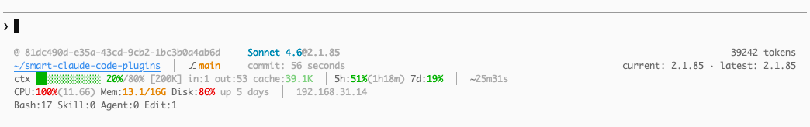

# smart-claude-code-plugins

<div align="center">

🌐 [English](./README.md) | [简体中文](./README_CN.md) | [繁體中文](./README_TW.md) | [한국어](./README_KO.md) | [日本語](./README_JA.md)

</div>

> 写完代码？直接说 **"发个PR"**，检查、提交、推送、PR 全自动搞定。
>
> 不想开 PR，只想 push？说 **"推一下"**。
>
> 只想 commit？说 **"提交"**。
>
> 也可以用斜杠命令：`/smart:pr`、`/smart:push`、`/smart:commit`。

一个为 Claude Code 设计的插件。代码写完之后，说一句话就行——它自动检查、提交、推送，并向 `main` 分支创建 Pull Request，无需任何额外操作。一句 `push`，自动拆分多 feature、生成 commit message 并推送，效果如下：



---

## 特性

**核心流水线**

- **Fail-Fast 管道** — 任意步骤失败立即停止，不会出现残缺推送或错误 PR。
- **自动 CI 检测** — 读取 `.github/workflows/*.yml`，在本地运行对应检查（ruff、pytest、mypy、eslint、tsc、vitest、jest、go test、turbo 等）。自动从 lock 文件检测包管理器。
- **两阶段智能提交分组** — 第一阶段按 type 硬分割（feat vs fix vs refactor），第二阶段按目的对同类 type 进行语义分割。杜绝无关改动混入同一次提交。
- **Conventional Commits** — 所有 commit message 自动遵循 `<type>(<scope>): <description>` 格式。优先尊重项目 `CLAUDE.md` 配置和已有 `git log` 风格。
- **自动版本升级** — 自动检测版本文件（`plugin.json`、`package.json`、`pyproject.toml`），分析 commit 类型，在推送前自动 bump 语义化版本号。Monorepo 中按文件归属映射到对应 package，各自独立升级。
- **自动创建 GitHub 仓库** — 未配置 remote？自动在 GitHub 创建私有仓库、设为 origin 并推送，全程无需手动操作。
- **语言一致性** — PR 标题、摘要和测试计划自动与 commit message 使用相同语言。默认英文，可通过项目 `CLAUDE.md` 覆盖。

**保护与自动化**

- **文件保护 Hook** — 阻止 Claude 编辑敏感文件（`.env`、lock 文件等）。通过项目级 `.claude/.protect_files.jsonc` 配置，支持精确文件名匹配和 glob 模式（`*`、`**`）。
- **会话 Hook** — 会话开始时问候，结束时告别（通过 macOS `say` TTS 语音播报）。
- **会话日志** — 每次工具调用的完整输入数据均记录到 `.claude/session-logs/`，便于事后调试和审计。

**实用工具**

- **HUD / Statusline 安装器** — 一条命令安装功能丰富的状态栏，显示模型、Git 分支、上下文用量、速率限制、系统资源和工具调用统计。支持安装 / 删除 / 回退。
- **上下文分析 Agent** — 分析哪些插件占用了最多的上下文窗口，按大小排名展示表格和百分比。
- **Joke Teller Agent** — 在合适的时机讲个程序员笑话，缓解工作压力。

---

## 快速开始

**1. 安装插件**（推荐）

先在 Claude Code 中注册插件市场：

```
/plugin marketplace add hinson0/smart-claude-code-plugins
```

然后从该市场安装插件：

```
/plugin install smart@smart-claude-code-plugins
```

**2. 登录 GitHub CLI** _（仅需一次）_

```bash
gh auth login
```

**3. 完成。在任意仓库中运行：**

```
/smart:pr
```

它会自动完成：检测 CI 配置并在本地运行检查 → 智能提交 → 版本升级 → 推送 → 在 GitHub 上创建 PR。

---

## 使用方式

**💬 自然语言** — 在对话中直接描述你的意图：

| 你说的话 | 执行效果 |
|---|---|
| "commit" / "提交" / "完成了" | 仅智能提交（暂存 + 分组 + 提交） |
| "push" / "推一下" | check → commit → version → push |
| "发个PR" / "create PR" / "open a pull request" | check → commit → version → push → PR |

**⌨️ 斜杠命令** — 精确控制：

| 命令 | 作用 |
|---|---|
| `/smart:pr [目标分支]` | 完整流程：check → commit → version → push → PR（默认目标分支：`main`） |
| `/smart:push` | check → commit → version → push（不创建 PR） |
| `/smart:commit` | 仅提交（智能分组，自动生成 message） |
| `/smart:version [基准分支]` | 分析 commit 并升级版本号（自动检测版本文件；仅在 base branch 上运行） |

---

## 流水线

### 总览

```
/smart:pr
    │
    ├── 1. check   — 自动 CI 检测，本地执行
    │
    ├── 2. commit  — 两阶段语义分析，智能分组提交
    │
    ├── 3. version — 语义化版本升级（支持 monorepo）
    │
    ├── 4. push    — 推送到 origin（需要时自动创建 GitHub 仓库）
    │
    └── 5. pr      — 生成并创建 Pull Request
```

每个阶段是独立的 skill，通过 `@../path/SKILL.md` 引用串联。任意阶段失败则立即停止整条流水线。

### 阶段一：Check

自动检测项目 CI 配置，在本地运行对应检查。

**工作流程：**

1. 扫描 `.github/workflows/*.yml`，识别工具关键字
2. 匹配工具：`ruff`、`pytest`、`mypy`、`eslint`、`tsc`、`vitest`、`jest`、`go test`、`golangci-lint`、`turbo` 等
3. 从 lock 文件检测包管理器（`uv.lock` → `uv run`、`pnpm-lock.yaml` → `pnpm`、`package-lock.json` → `npm run`、`go.mod` → 直接执行）
4. 顺序执行所有检测到的检查——任一失败即阻断后续流程
5. 允许 `ruff --fix` 在失败前自动修复问题

**支持的生态系统：**

| 生态系统 | 工具 |
|---|---|
| Python | ruff（lint + format）、pytest、mypy |
| JavaScript / TypeScript | eslint、tsc、vitest、jest、turbo |
| Go | go test、golangci-lint |

若项目中无 `.github/workflows/` 目录，此阶段静默跳过。

### 阶段二：Commit

核心智能——分析所有待提交变更，生成整洁、分组良好的提交。

**两阶段分组算法：**

1. **按 type 硬分割** — 先按 Conventional Commit 类型（`feat`、`fix`、`refactor`、`docs`、`test`、`chore`、`perf`、`ci`）分类。不同 type **必定**是独立提交。
2. **按目的语义分割** — 同一 type 内，若改动服务于不同目的，则进一步拆分。例如两个独立的 `feat` 新增功能会成为两次独立提交。

`scope` 字段描述的是"在哪里改"，不影响分组。分组逻辑完全由 type + purpose 驱动。

**Commit message 生成优先级：**

1. 项目 `CLAUDE.md` — 若指定了 commit 格式，优先使用
2. `git log` 风格 — 若已有提交遵循一致风格，自动匹配
3. 默认 — Conventional Commits：`<type>(<scope>): <description>`

**执行方式：**
- 单组 → `git add -A` + 提交
- 多组 → 逐组 `git add <具体文件>` + HEREDOC 提交
- 循环执行直到工作区干净（处理 hook 或 formatter 在提交过程中修改文件的情况）

### 阶段三：Version

分析 commit 历史，自动 bump 语义化版本号。

**Semver 规则：**

| Commit 模式 | Bump 类型 | 示例 |
|---|---|---|
| `feat` | minor | 0.1.0 → 0.2.0 |
| `fix`、`refactor`、`perf`、`docs` 等 | patch | 0.1.0 → 0.1.1 |
| `BREAKING CHANGE` 或 `!` 后缀 | major | 0.1.0 → 1.0.0 |

**版本文件检测：**

自动扫描项目根目录和 workspace 目录中的 `plugin.json`、`package.json`、`pyproject.toml`。

**Monorepo 支持：**

每个变更文件沿目录树向上查找最近的版本文件（"closest owner"策略），各 package 根据自己的 commit 独立 bump。

**行为：**
- 仅在 base branch 上运行（feature 分支自动跳过）
- 若上次 version bump 后无新提交，则跳过
- 所有版本变更统一提交为一个 `chore(version): bump version to X.X.X`

### 阶段四：Push

推送提交到远端仓库。

若未配置 `origin` remote：
1. 通过 `gh repo create` 在 GitHub 创建**私有**仓库
2. 设为 `origin`
3. 执行 `git push -u origin HEAD`

### 阶段五：PR

生成并在 GitHub 上创建 Pull Request。

**工作流程：**

1. 检测当前分支和语言（继承 commit 阶段的语言决策，或从 `git log` 推断）
2. 通过提示询问目标分支（默认 `main`）
3. 检查是否已存在相同 head branch 的开放 PR——若有则显示 URL 并停止
4. 收集 `BASE_BRANCH..HEAD` 之间的全部提交
5. 生成 PR 标题：
   - 单次提交 → 直接使用 commit message
   - 多次提交 → 生成概要标题
6. 生成 Markdown 格式 PR 正文：
   - **Summary** — 变更描述要点
   - **Commits** — 完整提交列表
   - **Test Plan** — 根据 commit 类型自动生成 `- [ ]` 检查清单（如 `feat` → "验证新功能正常工作"，`fix` → "确认 bug 已修复"）
7. 通过 `gh pr create` 创建 PR

PR 标题、正文和测试计划的语言与 commit message 保持一致。

---

## 文件保护

在项目根目录创建 `.claude/.protect_files.jsonc`，阻止 Claude 编辑敏感文件：

```jsonc
// 受保护的文件列表 — Claude Code 不可编辑
// 不含通配符的为精确文件名匹配，含 * 或 ** 的走 glob 模式
[
  ".env",
  "package-lock.json",
  "pnpm-lock.yaml",
  "yarn.lock",
  "*.secret",
  "config/production/**"
]
```

**匹配规则：**

| 模式 | 匹配方式 | 示例 |
|---|---|---|
| 无通配符 | 精确文件名 | `.env` 拦截 `.env` 但不影响 `.env.example` |
| `*` | 单层目录 glob | `*.lock` 匹配 `pnpm-lock.yaml` |
| `**` | 跨目录递归 | `config/production/**` 匹配 `config/production/db/secret.json` |

该 hook 通过 `PreToolUse` 拦截 `Edit` 和 `Write` 工具调用。若匹配到受保护文件，操作将被阻断并返回错误信息。

---

## HUD（状态栏）

一条命令安装功能丰富的状态栏：

```
/smart:hud
```



**显示内容（6 行）：**

| 行 | 内容 |
|----|------|
| 1 | 会话 ID / 会话名、模型@版本、总花费（USD） |
| 2 | 目录、Git 分支（dirty/ahead/behind/stash）、最近 commit 时间、worktree 名称、电池 |
| 3 | 上下文进度条 + tokens + cache、速率限制（5h/7d）含重置倒计时、会话时长、agent 名称 |
| 4 | CPU、内存、磁盘、运行时间、Runtime 版本（Node/Python/Go/Rust/Ruby）、本机 IP |
| 5 | 工具调用统计（Bash/Skill/Agent/Edit 次数，从 transcript 实时解析） |
| 6 | 输出风格、vim 模式（仅启用时显示） |

**命令：**

| 命令 | 操作 |
|------|------|
| `/smart:hud` | 安装（自动备份已有状态栏） |
| `/smart:hud rm` | 删除状态栏并恢复默认 |
| `/smart:hud rewind` | 从备份恢复之前的状态栏 |

**注意：** 需要安装 `jq`。状态栏脚本针对 macOS 优化（使用 `pmset` 获取电量、`sysctl` 获取系统信息）。

---

## Agents

### 上下文分析器（Context Analyzer）

诊断哪些插件占用了最多的上下文窗口。

```
"analyze context" / "哪个插件最大" / "context怎么这么高"
```

- 从 `~/.claude/settings.json` 读取已启用的插件列表
- 统计每个插件缓存目录下所有 `.md` 文件的大小
- 输出 Markdown 排名表，包含大小和百分比
- 将 3KB 以下的插件合并为 "Others"
- 在底部估算总上下文窗口占用百分比

### 笑话讲述器（Joke Teller）

讲个程序员笑话来缓解工作压力。

```
"tell me a joke" / "讲个笑话" / "I need a laugh"
```

- 自动检测对话语言，用对应语言讲笑话
- 短格式（2–4 句，抖包袱风格，不用一问一答模板）
- 附带一句温馨提醒（喝水、伸展、休息）

---

## 会话 Hooks

插件包含在会话边界和工具调用时触发的 hooks：

| Hook | 触发时机 | 功能 |
|------|---------|------|
| `greet.sh` | `SessionStart` | 通过 macOS TTS（`say`）播放欢迎语 |
| `goodbye.sh` | `SessionEnd` | 通过 macOS TTS（`say`）播放告别语 |
| `session-logs.py` | `PreToolUse`（所有工具） | 将每次工具调用的完整输入记录到 `.claude/session-logs/<日期>/<session_id>.json` |
| `protect-files.py` | `PreToolUse`（Edit/Write） | 阻止编辑受保护文件（参见[文件保护](#文件保护)） |

所有 hooks 通过 `${CLAUDE_PLUGIN_ROOT}` 解析路径。TTS hooks 在后台运行（`nohup &`），不阻塞 Claude Code。

---

## 前置要求

- [Claude Code](https://claude.ai/code) CLI
- `git`
- [`gh` CLI](https://cli.github.com) — 用于推送（自动创建 remote）和 PR 创建
- `jq` — 仅 HUD 状态栏需要（其他功能无需）

---

## 作者

**Hinson** · [GitHub](https://github.com/hinson0)

## License

MIT
