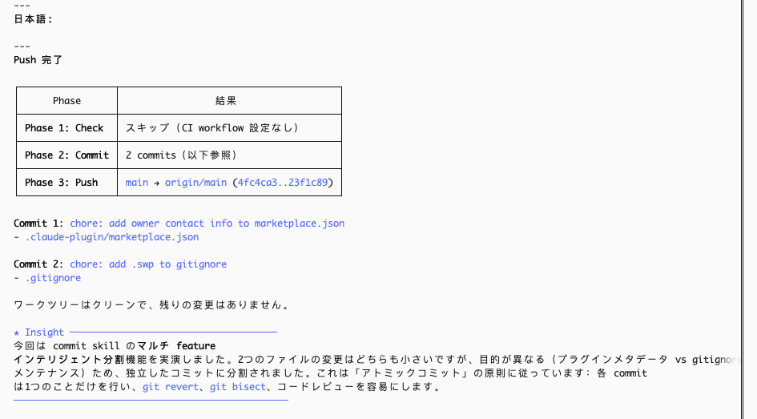

# smart-claude-code-plugins

<div align="center">

🌐 [English](./README.md) | [简体中文](./README_CN.md) | [繁體中文](./README_TW.md) | [한국어](./README_KO.md) | [日本語](./README_JA.md)

</div>

> コードを書き終えたら？**「PRを作って」**と言うだけ。チェック、コミット、プッシュ、PR まで全自動。
>
> PR はいらない、push だけ？**「プッシュして」**。
>
> commit だけ？**「コミットして」**。
>
> スラッシュコマンドも使えます：`/smart:pr`、`/smart:push`、`/smart:commit`。

Claude Code 向けのプラグインです。コードを書き終えたら、ひとこと言うだけ — 自動でチェック、コミット、プッシュし、`main` ブランチへの Pull Request を作成します。追加の操作は一切不要です。`push` の一言で、複数 feature の自動分割、commit message の生成、プッシュまで完了：



---

## 特徴

**コアパイプライン**

- **Fail-Fast パイプライン** — いずれかのステップが失敗した時点で即座に停止。不完全なプッシュや誤った PR は発生しません。
- **CI 自動検出** — `.github/workflows/*.yml` を読み取り、対応するローカルチェックを実行（ruff、pytest、mypy、eslint、tsc、vitest、jest、go test、turbo など）。lock ファイルからパッケージマネージャーを自動検出します。
- **2フェーズスマートコミットグルーピング** — フェーズ1では type で強制分割（feat vs fix vs refactor）、フェーズ2では同一 type 内で目的別に意味的分割。無関係な変更が1つのコミットに混入することを防止。
- **Conventional Commits** — すべての commit message が自動的に `<type>(<scope>): <description>` 形式に従います。プロジェクト `CLAUDE.md` の設定と既存の `git log` スタイルを優先的に尊重します。
- **自動バージョンバンプ** — バージョンファイル（`plugin.json`、`package.json`、`pyproject.toml`）を自動検出し、コミットタイプを分析してプッシュ前にセマンティックバージョンを自動バンプ。モノレポでは変更ファイルを所属パッケージにマッピングし、それぞれ独立にバンプします。
- **GitHub リポジトリ自動作成** — remote 未設定？自動で GitHub にプライベートリポジトリを作成し、origin に設定してプッシュします。手動操作は一切不要です。
- **言語の一貫性** — PR タイトル、概要、テストプランは commit message と同じ言語を自動的に使用します。デフォルトは英語で、プロジェクトの `CLAUDE.md` で変更可能。

**保護と自動化**

- **ファイル保護 Hook** — Claude が機密ファイル（`.env`、lock ファイルなど）を編集するのをブロックします。プロジェクトレベルの `.claude/.protect_files.jsonc` で設定し、正確なファイル名マッチングと glob パターン（`*`、`**`）をサポートします。
- **セッション Hook** — セッション開始時に挨拶、終了時にお別れ（macOS `say` TTS による音声出力）。
- **セッションログ** — すべてのツール呼び出しの完全な入力データが `.claude/session-logs/` に記録され、事後のデバッグと監査に活用できます。

**ユーティリティ**

- **HUD / Statusline インストーラー** — 1つのコマンドでモデル、Git ブランチ、コンテキスト使用量、レート制限、システムリソース、ツール呼び出し統計を表示するステータスラインをインストールします。インストール / 削除 / 復元をサポート。
- **コンテキスト分析 Agent** — どのプラグインが最もコンテキストウィンドウを消費しているか分析し、サイズ別ランキングテーブルとパーセンテージを表示します。
- **Joke Teller Agent** — 適切なタイミングでプログラマージョークを提供し、作業ストレスを和らげます。

---

## クイックスタート

**1. プラグインのインストール** _(強く推奨)_

まず Claude Code でプラグインマーケットプレイスを登録します：

```
/plugin marketplace add hinson0/smart-claude-code-plugins
```

次にそのマーケットプレイスからプラグインをインストールします：

```
/plugin install smart@smart-claude-code-plugins
```

**2. GitHub CLI にログイン** _(初回のみ)_

```bash
gh auth login
```

**3. 完了。任意のリポジトリで実行してください：**

```
/smart:pr
```

自動で実行されます：CI 設定を検出しローカルチェックを実行 → スマートコミット → バージョンバンプ → プッシュ → GitHub 上で PR を作成。

---

## 使い方

**💬 自然言語** — チャットでやりたいことを直接説明：

| 言う内容 | 実行結果 |
|---|---|
| "commit" / "コミットして" / "完了" | スマートコミットのみ（ステージング + グループ化 + コミット） |
| "push" / "プッシュして" | check → commit → version → push |
| "PRを作って" / "create PR" / "open a pull request" | check → commit → version → push → PR |

**⌨️ スラッシュコマンド** — 正確な制御：

| コマンド | 機能 |
|---|---|
| `/smart:pr [ターゲットブランチ]` | フルパイプライン：check → commit → version → push → PR（デフォルト：`main`） |
| `/smart:push` | check → commit → version → push（PR は作成しない） |
| `/smart:commit` | コミットのみ（スマートグルーピング、メッセージ自動生成） |
| `/smart:version [ベースブランチ]` | コミットを分析しバージョンをバンプ（バージョンファイルを自動検出；ベースブランチでのみ実行） |

---

## パイプライン

### 概要

```
/smart:pr
    │
    ├── 1. check   — CI 自動検出＆ローカル実行
    │
    ├── 2. commit  — 2フェーズセマンティック分析＆スマートグルーピング
    │
    ├── 3. version — セマンティックバージョンバンプ（モノレポ対応）
    │
    ├── 4. push    — origin にプッシュ（必要に応じて GitHub リポジトリを自動作成）
    │
    └── 5. pr      — Pull Request を生成＆作成
```

各フェーズは独立した skill であり、`@../path/SKILL.md` 参照で連結されています。いずれかのフェーズが失敗すると、パイプライン全体が即座に停止します。

### フェーズ1：Check

プロジェクトの CI 設定を自動検出し、対応するチェックをローカルで実行します。

**動作の仕組み：**

1. `.github/workflows/*.yml` をスキャンしてツールキーワードを識別
2. マッチングツール：`ruff`、`pytest`、`mypy`、`eslint`、`tsc`、`vitest`、`jest`、`go test`、`golangci-lint`、`turbo` など
3. lock ファイルからパッケージマネージャーを検出（`uv.lock` → `uv run`、`pnpm-lock.yaml` → `pnpm`、`package-lock.json` → `npm run`、`go.mod` → 直接実行）
4. 検出されたすべてのチェックを順次実行 — いずれかが失敗するとパイプラインを中断
5. `ruff --fix` が失敗前に問題を自動修正することを許可

**対応エコシステム：**

| エコシステム | ツール |
|---|---|
| Python | ruff（lint + format）、pytest、mypy |
| JavaScript / TypeScript | eslint、tsc、vitest、jest、turbo |
| Go | go test、golangci-lint |

プロジェクトに `.github/workflows/` ディレクトリがない場合、このフェーズはサイレントにスキップされます。

### フェーズ2：Commit

コアインテリジェンス — すべての保留中の変更を分析し、きれいにグループ化されたコミットを生成します。

**2フェーズグルーピングアルゴリズム：**

1. **type による強制分割** — まず Conventional Commit タイプ（`feat`、`fix`、`refactor`、`docs`、`test`、`chore`、`perf`、`ci`）で分類します。異なる type は**必ず**別のコミットになります。
2. **目的による意味的分割** — 同一 type 内で、異なる目的の変更はさらに分割されます。例えば、2つの独立した `feat` 追加は2つの別々のコミットになります。

`scope` フィールドは「どこを変更したか」を表し、グルーピングには影響しません。グルーピングロジックは純粋に type + purpose で決定されます。

**Commit message 生成の優先順位：**

1. プロジェクト `CLAUDE.md` — commit フォーマットが指定されていれば優先使用
2. `git log` スタイル — 既存のコミットが一貫したスタイルに従っていれば自動マッチング
3. デフォルト — Conventional Commits：`<type>(<scope>): <description>`

**実行方法：**
- 単一グループ → `git add -A` + コミット
- 複数グループ → グループごとに `git add <特定ファイル>` + HEREDOC コミット
- ワーキングツリーがクリーンになるまでループ（hook やフォーマッターがコミット中にファイルを変更する場合に対応）

### フェーズ3：Version

コミット履歴を分析し、セマンティックバージョン番号を自動バンプします。

**Semver ルール：**

| コミットパターン | バンプタイプ | 例 |
|---|---|---|
| `feat` | minor | 0.1.0 → 0.2.0 |
| `fix`、`refactor`、`perf`、`docs` など | patch | 0.1.0 → 0.1.1 |
| `BREAKING CHANGE` または `!` サフィックス | major | 0.1.0 → 1.0.0 |

**バージョンファイル検出：**

プロジェクトルートと workspace ディレクトリで `plugin.json`、`package.json`、`pyproject.toml` を自動スキャンします。

**モノレポサポート：**

各変更ファイルはディレクトリツリーを遡って最も近いバージョンファイルを検索します（「closest owner」戦略）。各パッケージは自身のコミットに基づいて独立にバンプされます。

**動作：**
- ベースブランチでのみ実行（feature ブランチでは自動スキップ）
- 前回のバージョンバンプ以降に新しいコミットがなければスキップ
- すべてのバージョン変更は単一の `chore(version): bump version to X.X.X` としてコミット

### フェーズ4：Push

リモートリポジトリにコミットをプッシュします。

`origin` remote が設定されていない場合：
1. `gh repo create` を通じて GitHub に**プライベート**リポジトリを作成
2. `origin` に設定
3. `git push -u origin HEAD` を実行

### フェーズ5：PR

GitHub 上で Pull Request を生成・作成します。

**動作の仕組み：**

1. 現在のブランチと言語を検出（commit フェーズの言語決定を継承、または `git log` から推論）
2. プロンプトでターゲットブランチを確認（デフォルト `main`）
3. 同じ head branch のオープン PR があるか確認 — あれば URL を表示して停止
4. `BASE_BRANCH..HEAD` 間のすべてのコミットを収集
5. PR タイトルを生成：
   - 単一コミット → commit message をそのまま使用
   - 複数コミット → 概要タイトルを生成
6. Markdown 形式の PR 本文を生成：
   - **Summary** — 変更内容の要点
   - **Commits** — 完全なコミットリスト
   - **Test Plan** — コミットタイプに基づいて `- [ ]` チェックリストを自動生成（例：`feat` → "verify new feature works"、`fix` → "confirm bug is resolved"）
7. `gh pr create` で PR を作成

PR タイトル、本文、テストプランの言語は commit message と一致します。

---

## ファイル保護

プロジェクトルートに `.claude/.protect_files.jsonc` を作成して、Claude が機密ファイルを編集するのをブロックします：

```jsonc
// 保護対象ファイルリスト — Claude Code は編集できません
// ワイルドカードなしは正確なファイル名マッチング、* または ** 付きは glob パターンマッチング
[
  ".env",
  "package-lock.json",
  "pnpm-lock.yaml",
  "yarn.lock",
  "*.secret",
  "config/production/**"
]
```

**マッチングルール：**

| パターン | マッチング方式 | 例 |
|---|---|---|
| ワイルドカードなし | 正確なファイル名 | `.env` は `.env` をブロックするが `.env.example` は許可 |
| `*` | 単一ディレクトリ glob | `*.lock` は `pnpm-lock.yaml` にマッチ |
| `**` | ディレクトリ横断再帰 | `config/production/**` は `config/production/db/secret.json` にマッチ |

この hook は `PreToolUse` を通じて `Edit` と `Write` ツール呼び出しをインターセプトします。保護対象ファイルがマッチした場合、操作はブロックされエラーメッセージが返されます。

---

## HUD（ステータスライン）

1つのコマンドで機能豊富なステータスラインをインストール：

```
/smart:hud
```


**表示内容（6行）：**

| 行 | 内容 |
|----|------|
| 1 | セッション ID / セッション名、モデル@バージョン、総コスト（USD） |
| 2 | ディレクトリ、Git ブランチ（dirty/ahead/behind/stash）、最近のコミット時間、worktree 名、バッテリー |
| 3 | コンテキスト進捗バー + トークン + キャッシュ、レート制限（5h/7d）リセットカウントダウン、セッション時間、agent 名 |
| 4 | CPU、メモリ、ディスク、稼働時間、ランタイムバージョン（Node/Python/Go/Rust/Ruby）、ローカル IP |
| 5 | ツール呼び出し統計（Bash/Skill/Agent/Edit 回数、transcript からリアルタイムにパース） |
| 6 | 出力スタイル、vim モード（有効時のみ表示） |

**コマンド：**

| コマンド | 操作 |
|----------|------|
| `/smart:hud` | インストール（既存のステータスラインを自動バックアップ） |
| `/smart:hud rm` | ステータスラインを削除しデフォルトに復元 |
| `/smart:hud rewind` | バックアップから以前のステータスラインを復元 |

**注意：** `jq` が必要です。ステータスラインスクリプトは macOS 向けに最適化されています（`pmset` でバッテリー、`sysctl` でシステム情報を取得）。

---

## Agents

### コンテキストアナライザー（Context Analyzer）

どのプラグインが最もコンテキストウィンドウを消費しているか診断します。

```
"analyze context" / "コンテキスト分析" / "どのプラグインが一番大きい"
```

- `~/.claude/settings.json` から有効なプラグインリストを読み取り
- 各プラグインキャッシュディレクトリのすべての `.md` ファイルサイズを測定
- サイズとパーセンテージを含む Markdown ランキングテーブルを出力
- 3KB 未満のプラグインは "Others" に統合
- 下部に総コンテキストウィンドウ占有率を推定

### ジョークテラー（Joke Teller）

プログラマージョークを提供して作業ストレスを和らげます。

```
"tell me a joke" / "ジョーク言って" / "I need a laugh"
```

- 会話言語を自動検出し、該当言語でジョークを提供
- 短い形式（2–4文、オチスタイル — Q&A 形式ではない）
- やさしいセルフケアリマインダー付き（水分補給、ストレッチ、休憩）

---

## セッション Hooks

セッション境界とツール呼び出し時にトリガーされる hook が含まれています：

| Hook | トリガー | 機能 |
|------|---------|------|
| `greet.sh` | `SessionStart` | macOS TTS（`say`）でウェルカムメッセージを再生 |
| `goodbye.sh` | `SessionEnd` | macOS TTS（`say`）でお別れメッセージを再生 |
| `session-logs.py` | `PreToolUse`（すべてのツール） | すべてのツール呼び出しの完全な入力を `.claude/session-logs/<日付>/<session_id>.json` に記録 |
| `protect-files.py` | `PreToolUse`（Edit/Write） | 保護対象ファイルの編集をブロック（[ファイル保護](#ファイル保護) 参照） |

すべての hook は `${CLAUDE_PLUGIN_ROOT}` でパスを解決します。TTS hook はバックグラウンドで実行され（`nohup &`）、Claude Code をブロックしません。

---

## 前提条件

- [Claude Code](https://claude.ai/code) CLI
- `git`
- [`gh` CLI](https://cli.github.com) — プッシュ（リモート自動作成）と PR 作成に使用
- `jq` — HUD ステータスラインのみ必要（その他の機能には不要）

---

## 作者

**Hinson** · [GitHub](https://github.com/hinson0)

## License

MIT
