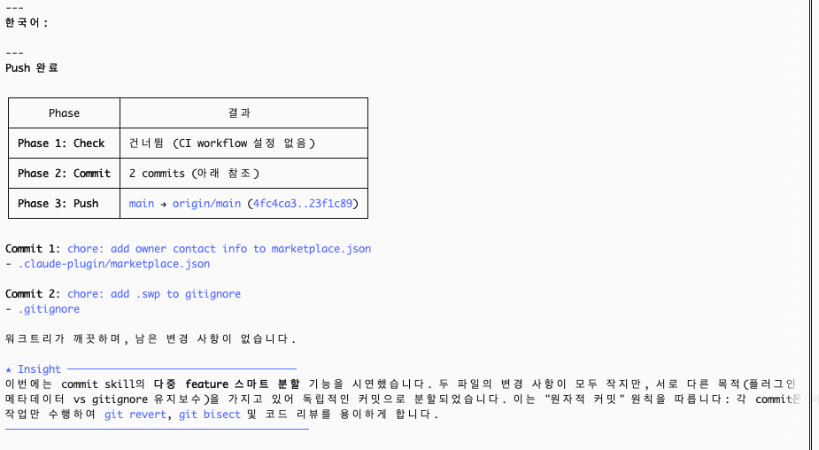

# smart-claude-code-plugin

<div align="center">

🌐 [English](./README.md) | [简体中文](./README_CN.md) | [繁體中文](./README_TW.md) | [한국어](./README_KO.md) | [日本語](./README_JA.md)

</div>

> 코드 작성 끝? **"PR 만들어"**라고 말하면 검사, 커밋, 푸시, PR까지 전부 자동.
>
> PR은 필요 없고 push만? **"푸시해"**.
>
> commit만? **"커밋해"**.
>
> 슬래시 명령어도 사용 가능: `/smart:pr`, `/smart:push`, `/smart:commit`.

Claude Code용 플러그인입니다. 코드 작성이 끝나면 한마디만 하세요 — 자동으로 검사, 커밋, 푸시하고 `main` 브랜치에 Pull Request를 생성합니다. 추가 작업은 필요 없습니다. `push` 한마디면, 다중 feature 자동 분리, commit message 생성, 푸시까지 완료:



---

## 두 가지 사용 방법

**💬 그냥 말하세요** — 채팅에서 자연스럽게 입력:

- "commit" / "커밋해" → 스마트 그룹화로 커밋
- "push" / "푸시해" → check + commit + push
- "PR 만들어" / "create PR" → check + commit + push + PR

**⌨️ 슬래시 명령어** — 명시적으로 지정하고 싶을 때:

| 명령어 | 기능 |
|---|---|
| `/smart:pr [대상 브랜치]` | 전체 파이프라인: check → commit → push → PR (기본: `main`) |
| `/smart:push` | check → commit → push (PR 생성 안 함) |
| `/smart:commit` | 커밋만 수행 (스마트 그룹화, 자동 메시지 생성) |

---

## 빠른 시작

**1. 플러그인 설치** _(강력 추천)_

먼저 Claude Code에서 플러그인 마켓플레이스를 등록합니다:

```
/plugin marketplace add hinson0/smart-claude-code-plugin
```

그다음 해당 마켓플레이스에서 플러그인을 설치합니다:

```
/plugin install smart@smart-claude-code-plugin
```

**2. GitHub CLI 로그인** _(최초 1회만)_

```bash
gh auth login
```

**3. 완료. 아무 저장소에서 실행하세요:**

```
/smart:pr
```

자동으로 수행됩니다: CI 설정 감지 후 로컬 검사 실행 → 스마트 커밋 → 푸시 → GitHub에서 PR 생성.

---

## 작동 방식

```
/smart:pr
    │
    ├── 1. check   — .github/workflows/*.yml을 읽고 해당하는 로컬 검사 실행
    │                (ruff/pytest, eslint/tsc, go test — CI 설정 없으면 건너뜀)
    │
    ├── 2. commit  — 변경 사항을 의미적으로 분석, commit message 자동 생성
    │                (독립적인 feature가 여러 개면 자동으로 여러 커밋으로 분리)
    │
    ├── 3. push    — origin으로 푸시
    │                (remote 미설정 시 자동으로 GitHub 저장소 생성 및 연결)
    │
    └── 4. pr      — 제목과 본문을 자동 생성하여 Pull Request 생성
```

어떤 단계든 실패하면 즉시 중단되며, 이후 단계는 실행되지 않습니다.

---

## 사전 요구 사항

- [Claude Code](https://claude.ai/code) CLI
- `git`
- [`gh` CLI](https://cli.github.com) — GitHub remote 자동 생성 및 PR 생성에 사용

---

## 저자

**Hinson** · [GitHub](https://github.com/hinson0)

## License

MIT
