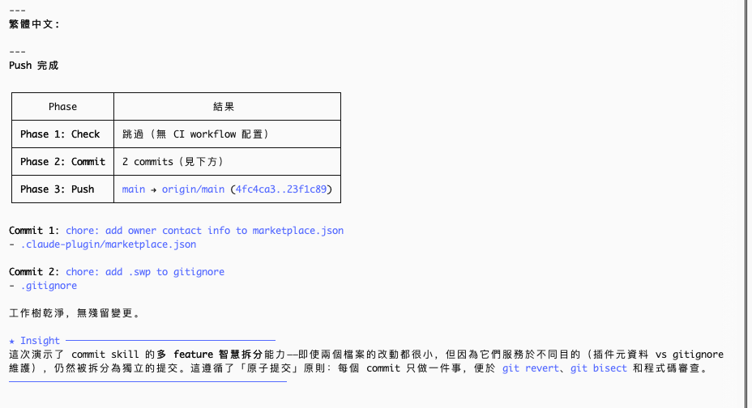

# smart-claude-code-plugins

<div align="center">

🌐 [English](./README.md) | [简体中文](./README_CN.md) | [繁體中文](./README_TW.md) | [한국어](./README_KO.md) | [日本語](./README_JA.md)

</div>

> 寫完程式碼？直接說 **"發個PR"**，檢查、提交、推送、PR 全自動搞定。
>
> 不想開 PR，只想 push？說 **"推一下"**。
>
> 只想 commit？說 **"提交"**。
>
> 也可以用斜線指令：`/smart:pr`、`/smart:push`、`/smart:commit`。

一個為 Claude Code 設計的外掛。程式碼寫完之後，說一句話就行——它自動檢查、提交、推送，並向 `main` 分支建立 Pull Request，無需任何額外操作。一句 `push`，自動拆分多 feature、產生 commit message 並推送，效果如下：



---

## 特性

- **兩階段智慧提交分組** — 第一階段按 type 硬分割（feat vs fix vs refactor），第二階段按目的對同類 type 進行語義分割。杜絕無關變更混入同一次提交。
- **Fail-Fast 管線** — 任意步驟失敗立即停止，不會出現殘缺推送或錯誤 PR。
- **自動 CI 偵測** — 讀取 `.github/workflows/*.yml`，在本機執行對應檢查（ruff、pytest、eslint、tsc、jest、go test、turbo 等）。
- **自動建立 GitHub 倉庫** — 未設定 remote？自動為你建立。
- **Conventional Commits** — 所有 commit message 自動遵循 `<type>(<scope>): <description>` 格式。
- **自動版本升級** — 自動偵測版本檔案（`plugin.json`、`package.json` 或 `pyproject.toml`），分析 commit 類型，在推送前自動 bump 語義化版本號。Monorepo 中按檔案歸屬對映到對應 package，各自獨立升級。
- **語言一致性** — PR 標題、摘要和測試計畫自動與 commit message 使用相同語言。預設英文，可透過專案 `CLAUDE.md` 覆蓋。
- **檔案保護 Hook** — 阻止 Claude 編輯敏感檔案（`.env`、lock 檔案等）。透過專案級 `.claude/.protect_files.jsonc` 設定，支援精確檔名配對和 glob 模式（`*`、`**`）。
- **會話 Hook** — 會話開始時問候，結束時告別。
- **上下文分析 Agent** — 分析哪些外掛占用了最多的上下文視窗，按大小排名展示表格和百分比。

---

## 兩種使用方式

**💬 直接說** — 在對話中自然表達：

- "commit" / "提交" / "完成了" → 智慧提交
- "push" / "推一下" → check + commit + version + push
- "發個PR" / "create PR" → check + commit + version + push + PR

**⌨️ 斜線指令** — 精確控制：

| 指令 | 作用 |
|---|---|
| `/smart:pr [目標分支]` | 完整流程：check → commit → version → push → PR（預設目標分支：`main`） |
| `/smart:push` | check → commit → version → push（不建立 PR） |
| `/smart:commit` | 僅提交（智慧分組，自動產生 message） |
| `/smart:check` | 僅執行本機 CI 檢查（自動偵測 workflow 設定） |
| `/smart:version [基準分支]` | 分析 commit 並升級版本號（自動偵測 plugin.json / package.json / pyproject.toml） |

---

## 快速開始

**1. 安裝外掛**（強烈推薦）

先在 Claude Code 中註冊外掛市場：

```
/plugin marketplace add hinson0/smart-claude-code-plugins
```

然後從該市場安裝外掛：

```
/plugin install smart@smart-claude-code-plugins
```

**2. 登入 GitHub CLI** _（僅需一次）_

```bash
gh auth login
```

**3. 完成。在任意倉庫中執行：**

```
/smart:pr
```

它會自動完成：偵測 CI 設定並在本機執行檢查 → 智慧提交 → 版本升級 → 推送 → 在 GitHub 上建立 PR。

---

## 工作原理

```
/smart:pr
    │
    ├── 1. check   — 讀取 .github/workflows/*.yml，執行對應本機檢查
    │                （ruff/pytest、eslint/tsc、go test，無 CI 設定則跳過）
    │
    ├── 2. commit  — 兩階段語義分析：
    │                第一階段：按 type 硬分割（feat/fix/refactor/...）
    │                第二階段：同類 type 按目的再分割
    │                （自動產生 Conventional Commit message）
    │
    ├── 3. version — 偵測版本檔案（plugin.json / package.json / pyproject.toml）
    │                分析 commit 類型 → 自動 bump 語義化版本（major/minor/patch）
    │                （monorepo：按檔案歸屬對映到對應 package，各自獨立升級）
    │
    ├── 4. push    — 推送到 origin
    │                （未設定 remote 時自動在 GitHub 建立倉庫並關聯）
    │
    └── 5. pr      — 自動產生標題和內文，建立 Pull Request
                     （語言跟隨步驟 2 的 commit message）
```

任意步驟失敗均立即停止，不會執行後續操作。

---

## 檔案保護

在專案根目錄建立 `.claude/.protect_files.jsonc`，阻止 Claude 編輯敏感檔案：

```jsonc
// 受保護的檔案清單 — Claude Code 不可編輯
// 不含萬用字元的為精確檔名配對，含 * 或 ** 的走 glob 模式
[
  ".env",
  "package-lock.json",
  "pnpm-lock.yaml",
  "yarn.lock",
  "*.secret",
  "config/production/**"
]
```

**配對規則：**
- 無萬用字元 → 精確檔名配對（`.env` 會攔截 `.env` 但不影響 `.env.example`）
- `*` → 單層目錄 glob 配對（`*.lock` 配對 `pnpm-lock.yaml`）
- `**` → 跨目錄遞迴配對（`config/production/**` 配對 `config/production/db/secret.json`）

---

## 前置需求

- [Claude Code](https://claude.ai/code) CLI
- `git`
- [`gh` CLI](https://cli.github.com) — 用於自動建立 GitHub remote 和 PR

---

## 作者

**Hinson** · [GitHub](https://github.com/hinson0)

## License

MIT
